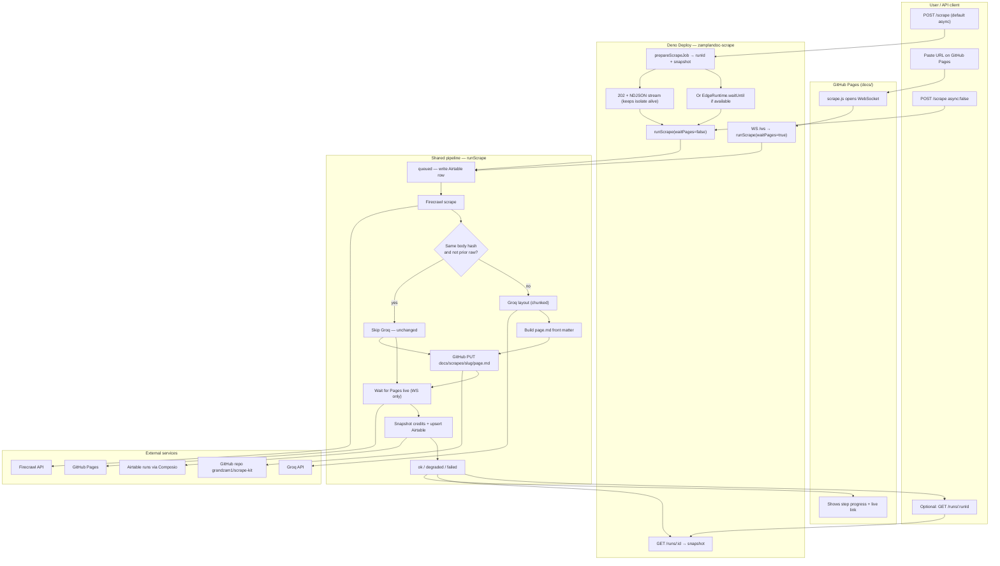
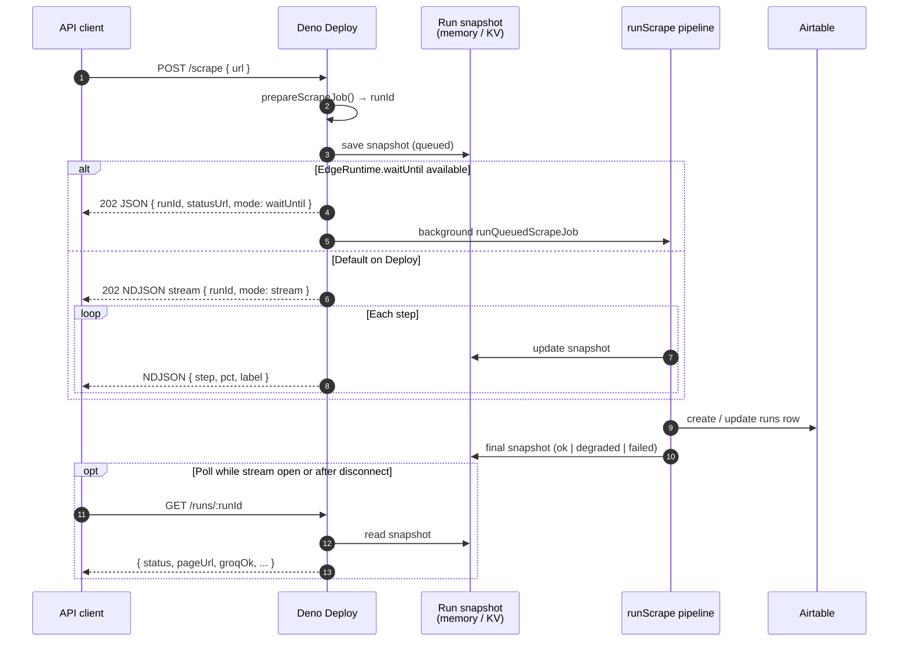
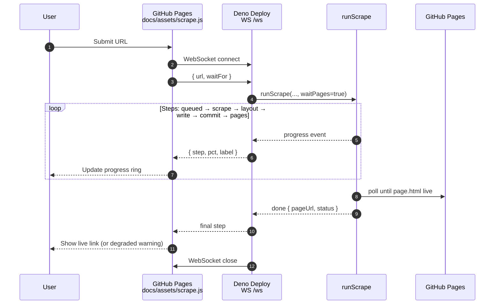

# scrape-kit workflow

Production app: **GitHub Pages UI** → **Deno Deploy** (`zamplandoc-scrape`) → **Firecrawl + Groq** → **GitHub commit** → **Pages live URL** → **Airtable `runs` log**.

Live endpoints:

| Endpoint | Role |
|----------|------|
| `GET /health` | Service info |
| `WebSocket /ws` | Browser UI (GitHub Pages) — streaming steps, waits for Pages |
| `POST /scrape` | API — default **async** (`202` + NDJSON stream) |
| `POST /scrape` + `"async": false` | API — sync single JSON when finished |
| `GET /runs/:runId` | Poll run snapshot (memory, or KV if provisioned on Deploy) |

Status lifecycle: `queued` → `ok` | `degraded` | `failed`

---

## Swimlane — entry paths

Three ways to start a scrape. All converge on the same `runScrape` pipeline.

---

## Swimlane — async API detail (Phase 3)

New Deno Deploy does **not** support `Kv.enqueue` / `listenQueue`. Async uses a **202 response** plus either a progress stream or background `waitUntil`.

---

## Swimlane — browser UI (WebSocket)

The home page does **not** use `POST /scrape`. It keeps one WebSocket open for the whole run (isolate stays alive; Pages wait enabled).

---

## Pipeline steps (all paths)

| Step | What happens |
|------|----------------|
| **queued** | Assign `runId`, slug, `pageUrl`; create Airtable row; save snapshot |
| **scrape** | Firecrawl fetches URL → markdown + title; record Firecrawl credits |
| **layout** | If body hash unchanged and prior publish was not `raw` → skip Groq. Else Groq JSON layout (chunked, TPM throttle, max 2 chunks) |
| **write** | Build Deno `page.md` with front matter (`layoutSource`, `contentHash`, `runId`) |
| **commit** | `githubPutFile` → `docs/scrapes/<slug>/page.md` |
| **pages** | WS path: wait until `page.html` is live on GitHub Pages |
| **done** | Final status `ok` / `degraded` / `failed`; vendor credits on Airtable; snapshot updated |

---

## Out of scope (lab only)

Node CLI (`npm run scrape -- --job jobs/...`) uses Composio + local `output/`. It does **not** publish to GitHub Pages or use this Deno pipeline.

See also: [ARCHITECTURE.md](./ARCHITECTURE.md)
